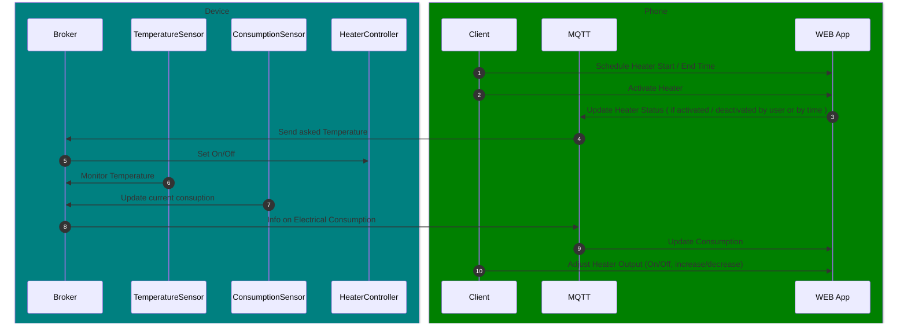
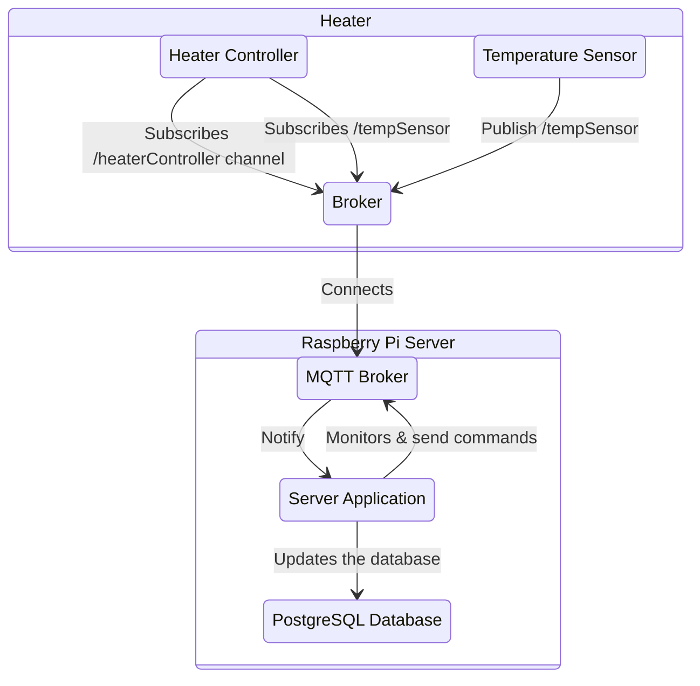

# Heaters
Gestion Chauffage

```mermaid
sequenceDiagram
    autonumber
    box Teal Device
        participant B as Broker
        participant TS as TemperatureSensor
        participant CS as ConsumptionSensor
        participant HC as HeaterController
        end
    box Green Phone
        participant C as Client
        participant M as MQTT
        participant AP as WEB App
    end
        C ->> AP: Schedule Heater Start / End Time
        C ->> AP: Activate Heater
        AP ->> M: Update Heater Status ( if activated / deactivated by user or by time )
        M ->> B: Send asked Temperature
        B ->> HC: Set On/Off
        TS ->> B: Monitor Temperature
        
        CS ->> B : Update current consuption
        B ->> M: Info on Electrical Consumption
        M ->> AP: Update Consumption
        C ->> AP: Adjust Heater Output (On/Off, increase/decrease)
```
### Architecture

```mermaid
stateDiagram-v2
    S: Raspberry Pi Server
    state S {
        MQTT: MQTT Broker
        A: Server Application
        DB: PostgreSQL Database
        
        A --> MQTT: Monitors & send commands
        MQTT --> A: Notify
        
        A --> DB: Updates the database
    }
    
    LD: Heater
    state LD {
        B: Broker
        LC: Heater Controller
        TS: Temperature Sensor
        
        
        LC --> B: Subscribes /heaterController channel
        LC --> B: Subscribes /tempSensor
        TS --> B: Publish /tempSensor
    }
    
    B --> MQTT: Connects
    
```