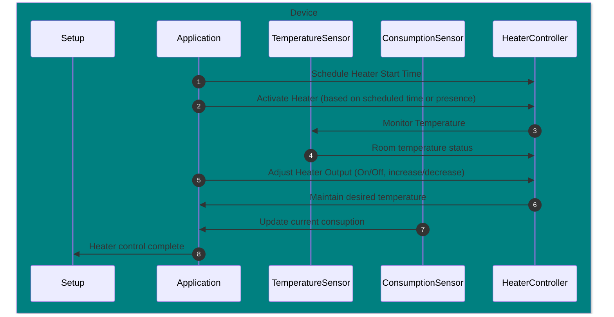

# Heaters
Gestion Chauffage

```mermaid
sequenceDiagram
    autonumber
    box Teal Device
        participant S as Setup
        participant A as Application
        participant TS as TemperatureSensor
        participant CS as ConsumptionSensor
        participant HC as HeaterController
        end
        A ->> HC: Schedule Heater Start Time
        A ->> HC: Activate Heater (based on scheduled time or presence)
        HC ->> TS: Monitor Temperature
        TS ->> HC: Room temperature status
        A ->> HC: Adjust Heater Output (On/Off, increase/decrease)
        HC ->> A: Maintain desired temperature
        CS ->> A : Update current consuption
        A ->> S: Heater control complete
        
```
