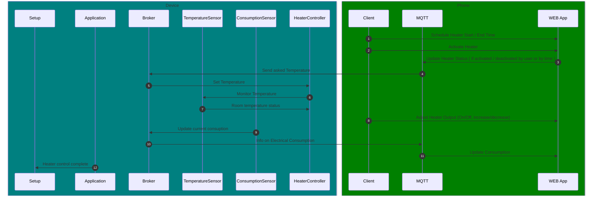

# Heaters
Gestion Chauffage

```mermaid
sequenceDiagram
    autonumber
    box Teal Device
        participant S as Setup
        participant A as Application
        participant B as Broker
        participant TS as TemperatureSensor
        participant CS as ConsumptionSensor
        participant HC as HeaterController
        end
    box Green Phone
        participant C as Client
        participant M as MQTT
        participant AP as WEB App
    end
        C ->> AP: Schedule Heater Start / End Time
        C ->> AP: Activate Heater
        AP ->> M: Update Heater Status ( if activated / deactivated by user or by time )
        M ->> B: Send asked Temperature
        B ->> HC: Set Temperature
        HC ->> TS: Monitor Temperature
        TS ->> HC: Room temperature status
        C ->> AP: Adjust Heater Output (On/Off, increase/decrease)
        CS ->> B : Update current consuption
        B ->> M: Info on Electrical Consumption
        M ->> AP: Update Consumption 
        A ->> S: Heater control complete
        
```
